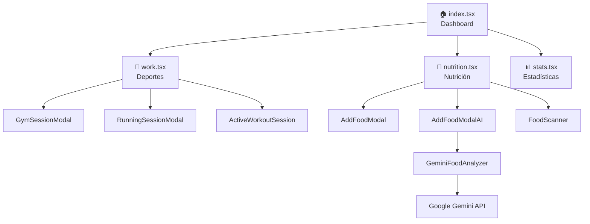
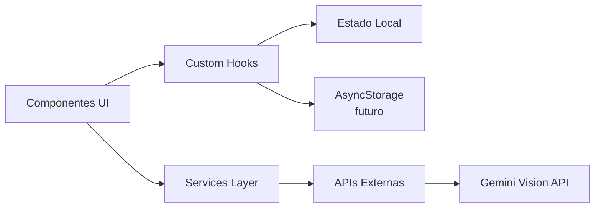

# Arquitectura de Alzan

## Índice
1. [Visión General](#visión-general)
2. [Stack Tecnológico](#stack-tecnológico)
3. [Estructura del Proyecto](#estructura-del-proyecto)
4. [Arquitectura de Componentes](#arquitectura-de-componentes)
5. [Flujo de Datos](#flujo-de-datos)
6. [Patrones de Diseño](#patrones-de-diseño)
7. [Seguridad y Privacidad](#seguridad-y-privacidad)

---

## Visión General

**Alzan** es una aplicación móvil multiplataforma (iOS, Android, Web) construida con **React Native** y **Expo**, diseñada para unificar la planificación deportiva, el seguimiento nutricional y el análisis de progreso en una experiencia integrada.

### Objetivos principales
- **Centralización**: Un solo lugar para gestionar fitness y nutrición
- **Inteligencia**: Uso de IA (Google Gemini) para análisis nutricional de imágenes
- **Usabilidad**: Interfaz intuitiva con gradientes vibrantes y animaciones fluidas
- **Modularidad**: Componentes reutilizables y bien organizados

---

## Stack Tecnológico

### Framework y Runtime
| Tecnología | Versión | Propósito |
|------------|---------|-----------|
| **Expo** | 54.0.24 | SDK y herramientas de desarrollo |
| **React Native** | 0.81.5 | Framework UI multiplataforma |
| **React** | 19.1.0 | Biblioteca de UI |
| **TypeScript** | 5.9.3 | Tipado estático |

### Routing y Navegación
- **expo-router** (6.0.15): Navegación basada en sistema de archivos
- **@react-navigation/bottom-tabs**: Tabs inferiores personalizadas
- **@react-navigation/native**: Navegación core

### UI y Experiencia de Usuario
- **react-native-paper** (5.14.5): Componentes Material Design
- **expo-linear-gradient**: Gradientes personalizados
- **@expo/vector-icons**: Biblioteca de iconos
- **react-native-reanimated** (4.1.6): Animaciones de alta performance
- **expo-blur**: Efectos glassmorphism

### Cámara y Medios
- **expo-camera** (17.0.9): Acceso a cámara
- **expo-image-picker** (17.0.8): Selección de imágenes
- **expo-image-manipulator** (14.0.7): Manipulación de imágenes
- **expo-image**: Optimización de imágenes

### Servicios e Integraciones
- **Google Gemini API**: Análisis de imágenes nutricionales con IA
- **expo-localization**: Internacionalización
- **expo-haptics**: Feedback táctil

### Otras Utilidades
- **xlsx** (0.18.5): Exportación de datos
- **react-native-gesture-handler**: Gestión de gestos
- **expo-constants**: Variables de entorno

---

## Estructura del Proyecto

```
alzan-old/
├── app/                          # Rutas y páginas (Expo Router)
│   ├── (tabs)/                   # Layout de pestañas principales
│   │   ├── _layout.tsx           # Configuración del TabNavigator
│   │   ├── index.tsx             # 🏠 Pantalla de inicio/dashboard
│   │   ├── work.tsx              # 💪 Planificador deportivo
│   │   ├── nutrition.tsx         # 🥗 Seguimiento nutricional
│   │   └── stats.tsx             # 📊 Panel de estadísticas
│   ├── _layout.tsx               # Layout raíz de la app
│   └── +not-found.tsx            # Página 404
│
├── components/                   # Componentes reutilizables
│   ├── sport/                    # Módulos deportivos
│   │   ├── gym/                  # Sesiones de gimnasio
│   │   │   ├── ActiveWorkoutSession.tsx
│   │   │   ├── ExerciseCard.tsx
│   │   │   ├── ExerciseSelector.tsx
│   │   │   ├── GymSessionModal.tsx
│   │   │   ├── RestTimerModal.tsx
│   │   │   └── WorkoutIntensityModal.tsx
│   │   ├── common/               # Componentes compartidos
│   │   │   ├── SportCard.tsx
│   │   │   ├── WeeklyCalendar.tsx
│   │   │   ├── SessionSummaryModal.tsx
│   │   │   └── SportPlanModal.tsx
│   │   ├── other/                # Otros deportes
│   │   │   ├── RunningSessionModal.tsx
│   │   │   ├── CyclingSessionModal.tsx
│   │   │   └── SwimmingSessionModal.tsx
│   │   └── SupersetBuilder.tsx   # Constructor de superseries
│   │
│   ├── nutri/                    # Módulos nutricionales
│   │   ├── MealCard.tsx          # Tarjeta de comida
│   │   ├── AddFoodModal.tsx      # Modal añadir comida manualmente
│   │   ├── AddFoodModalAI.tsx    # Modal añadir con IA
│   │   ├── FoodScanner.tsx       # Scanner de código de barras
│   │   └── AddExtraMealModal.tsx # Añadir comida adicional
│   │
│   ├── stats/                    # Componentes de estadísticas
│   │   ├── WeeklyProgressChart.tsx
│   │   ├── PersonalRecordsCard.tsx
│   │   ├── ConsistencyTracker.tsx
│   │   ├── NutritionSummary.tsx
│   │   └── WorkoutSummary.tsx
│   │
│   ├── services/                 # Servicios e integraciones
│   │   ├── GeminiFoodAnalyzer.ts # Análisis de comida con IA
│   │   └── FoodAnalysisService.ts# Servicio wrapper
│   │
│   └── ui/                       # Componentes UI base
│       ├── Button.tsx
│       ├── Card.tsx
│       ├── Input.tsx
│       └── Modal.tsx
│
├── constants/                    # Constantes y configuración
│   └── Colors.ts                 # Paleta de colores
│
├── hooks/                        # Custom hooks
│   ├── useColorScheme.ts         # Hook para tema claro/oscuro
│   ├── useThemeColor.ts          # Hook para colores temáticos
│   └── useSportsData.ts          # Hook para datos deportivos
│
├── assets/                       # Recursos estáticos
│   ├── images/                   # Imágenes e iconos
│   └── fonts/                    # Fuentes personalizadas
│
├── .expo/                        # Archivos de configuración Expo
├── app.json                      # Configuración de Expo
├── package.json                  # Dependencias
├── tsconfig.json                 # Configuración TypeScript
├── babel.config.js               # Configuración Babel
└── eslint.config.js              # Configuración ESLint
```

---

## Arquitectura de Componentes

### 1. Pantallas Principales (app/(tabs)/)

#### 🏠 index.tsx - Pantalla de Inicio
**Propósito**: Dashboard motivacional con resumen diario

**Componentes clave**:
- Tarjetas de calorías consumidas vs. objetivo
- Contador de pasos
- Progreso semanal de hábitos
- Accesos rápidos a entrenamiento y nutrición

**Navegación**:
```typescript
const navigateToWorkout = () => router.push('/work');
const navigateToNutrition = () => router.push('/nutrition');
```

#### 💪 work.tsx - Planificador Deportivo
**Propósito**: Gestión completa de entrenamientos

**Funcionalidades**:
- Calendario semanal de planificación
- Soporte para múltiples deportes:
  - 🏋️ Gimnasio (series, repeticiones, peso)
  - 🏃 Running (distancia, ritmo, tiempo)
  - 🚴 Ciclismo (distancia, velocidad, potencia)
  - 🏊 Natación (distancia, estilo, tiempo)
- Timer de descanso entre series
- Registro de intensidad post-entreno

**Componentes principales**:
- `WeeklyCalendar`: Vista semanal con sesiones planificadas
- `ActiveWorkoutSession`: Sesión de entrenamiento activa
- `GymSessionModal`: Modal para configurar sesión de gym
- `RestTimerModal`: Temporizador de descanso

#### 🥗 nutrition.tsx - Seguimiento Nutricional
**Propósito**: Registro y análisis de comidas

**Funcionalidades**:
- Agenda de comidas (desayuno, almuerzo, cena, snacks)
- Análisis nutricional con IA (Gemini)
- Scanner de código de barras
- Control de hidratación
- Cálculo automático de macros

**Componentes principales**:
- `MealCard`: Tarjeta individual de comida
- `AddFoodModal`: Modal para añadir comida manual
- `AddFoodModalAI`: Modal con análisis IA
- `FoodScanner`: Scanner de productos

**Flujo de análisis IA**:
```
Usuario toma foto → GeminiFoodAnalyzer → Gemini API → Respuesta JSON → Validación → UI
```

#### 📊 stats.tsx - Panel de Estadísticas
**Propósito**: Visualización de progreso y métricas

**Métricas mostradas**:
- Progreso semanal (calorías, macros)
- Récords personales (peso máximo, distancia, etc.)
- Consistencia de entrenamientos
- Resumen nutricional
- Comparativas temporales

---

### 2. Módulos Deportivos (components/sport/)

#### Gimnasio (gym/)
Sistema completo para entrenamientos de fuerza:

**ActiveWorkoutSession.tsx**
- Gestión de ejercicios en tiempo real
- Control de series y repeticiones
- Timer automático de descanso
- Registro de peso utilizado

**ExerciseCard.tsx**
- Vista individual de ejercicio
- Edición inline de sets/reps
- Marcado de series completadas

**RestTimerModal.tsx**
- Temporizador configurable (30s, 60s, 90s, 120s)
- Notificación al completarse
- Vibración al finalizar

**WorkoutIntensityModal.tsx**
- Escala RPE (Rate of Perceived Exertion) 1-10
- Notas post-entrenamiento
- Guardado de feedback

#### Otros Deportes (other/)
Modales especializados para:
- **Running**: Distancia, ritmo, elevación, tiempo
- **Cycling**: Distancia, velocidad media, potencia (watts)
- **Swimming**: Distancia, estilo (libre, espalda, mariposa, pecho)

---

### 3. Módulos Nutricionales (components/nutri/)

#### FoodScanner.tsx
Scanner de código de barras con feedback visual:
```typescript
interface BarcodeData {
  type: string;
  data: string;
}

// Proceso:
// 1. Solicitar permisos de cámara
// 2. Activar scanner
// 3. Detectar código
// 4. Buscar en base de datos
// 5. Autocompletar información nutricional
```

#### AddFoodModal.tsx
Modal completo para registro manual:
- Nombre del alimento
- Cantidad y unidades (g, ml, unidades)
- Macros (calorías, proteínas, carbohidratos, grasas)
- Fibra, azúcares (opcional)
- Categoría (comida real, procesada, ultraprocesada)

#### AddFoodModalAI.tsx
Integración con Gemini para análisis automático:
- Captura de foto
- Envío a GeminiFoodAnalyzer
- Parsing de respuesta
- Pre-rellenado de formulario
- Confirmación y ajustes manuales

---

### 4. Servicios e Integraciones

#### GeminiFoodAnalyzer.ts
Servicio principal de análisis con IA:

**Características**:
- Conversión de imagen a base64
- Prompt engineering optimizado
- Parsing robusto de respuestas
- Validación de datos
- Manejo de errores

**Estructura de respuesta**:
```typescript
interface FoodAnalysisResult {
  detectedFood: string;           // "Ensalada mixta con pollo"
  estimatedQuantity: string;      // "350g"
  nutrition: {
    calories: number;             // 420
    protein: number;              // 35g
    carbs: number;                // 20g
    fats: number;                 // 18g
    fiber?: number;               // 8g
    sugar?: number;               // 5g
  };
  confidence: number;             // 0-100
  ingredients: string[];          // ["lechuga", "tomate", "pollo"]
  category: 'real' | 'good' | 'ultra';
}
```

**Prompt Engineering**:
El prompt está optimizado para obtener respuestas consistentes:
```
Analiza esta imagen de comida y proporciona:
1. Nombre del plato/alimento
2. Cantidad estimada
3. Valores nutricionales (cal, proteína, carbos, grasas)
4. Ingredientes principales
5. Clasificación (comida real/procesada/ultraprocesada)

Devuelve SOLO JSON válido sin texto adicional.
```

---

## Flujo de Datos

### 1. Estado Local (useState)
Componentes simples usan estado local de React:
```typescript
const [meals, setMeals] = useState<Meal[]>([]);
const [isModalVisible, setModalVisible] = useState(false);
```

### 2. Props Drilling
Paso de datos entre componentes padre-hijo:
```typescript
// En nutrition.tsx
<MealCard 
  meal={meal}
  onEdit={handleEditMeal}
  onDelete={handleDeleteMeal}
/>
```

### 3. Custom Hooks
Lógica reutilizable encapsulada:
```typescript
// useColorScheme.ts
const colorScheme = useColorScheme();
const backgroundColor = colorScheme === 'dark' ? '#000' : '#FFF';
```

### 4. AsyncStorage (futuro)
Para persistencia de datos:
```typescript
// Guardar plan semanal
await AsyncStorage.setItem('weeklyPlan', JSON.stringify(plan));

// Recuperar plan
const savedPlan = await AsyncStorage.getItem('weeklyPlan');
```

### 5. API Calls
Llamadas a servicios externos:
```typescript
// Análisis con Gemini
const result = await GeminiFoodAnalyzer.analyzeFood(imageUri);
```

---

## Patrones de Diseño

### 1. Component Composition
Composición de componentes pequeños y enfocados:
```typescript
// MealCard compuesto de subcomponentes
<MealCard>
  <MealHeader />
  <MacrosBadges />
  <FoodList />
  <ActionButtons />
</MealCard>
```

### 2. Render Props
Delegación de renderizado:
```typescript
<FoodScanner
  onScan={(barcode) => handleBarcodeScan(barcode)}
  renderOverlay={() => <ScannerOverlay />}
/>
```

### 3. Higher-Order Components (HOC)
Componentes envueltos con funcionalidad:
```typescript
const ThemedCard = withTheme(Card);
```

### 4. Custom Hooks
Lógica extraída y reutilizable:
```typescript
const useMealTracking = () => {
  const [meals, setMeals] = useState([]);
  const addMeal = (meal) => setMeals([...meals, meal]);
  const removeMeal = (id) => setMeals(meals.filter(m => m.id !== id));
  
  return { meals, addMeal, removeMeal };
};
```

### 5. Service Layer
Separación de lógica de negocio:
```typescript
// En lugar de llamar directamente fetch() en componentes:
// ✅ Bueno
const result = await FoodAnalysisService.analyze(image);

// ❌ Malo
const result = await fetch(API_URL, {...});
```

---

## Seguridad y Privacidad

### 1. API Keys
> [!CAUTION]
> **Actualmente la API key de Gemini está hardcodeada en el código.**

**Solución recomendada**:
```typescript
// .env
GEMINI_API_KEY=tu_clave_secreta

// app.config.js
export default {
  extra: {
    geminiApiKey: process.env.GEMINI_API_KEY
  }
};

// En el código
import Constants from 'expo-constants';
const API_KEY = Constants.expoConfig.extra.geminiApiKey;
```

### 2. Permisos de Cámara
Solicitud explícita y manejo de rechazo:
```typescript
const { status } = await Camera.requestCameraPermissionsAsync();
if (status !== 'granted') {
  Alert.alert('Permiso denegado', 'Necesitamos acceso a la cámara');
  return;
}
```

### 3. Validación de Inputs
Sanitización de entradas del usuario:
```typescript
const validateMacros = (value: string) => {
  const num = parseFloat(value);
  return !isNaN(num) && num >= 0 && num <= 10000;
};
```

### 4. Datos Sensibles
No almacenar información personal sin encriptación:
```typescript
// Para futuras implementaciones
import * as SecureStore from 'expo-secure-store';
await SecureStore.setItemAsync('userToken', token);
```

---

## Escalabilidad y Mejoras Futuras

### 1. Estado Global
Implementar **Redux** o **Zustand** para estado compartido:
```typescript
// store.ts
import create from 'zustand';

const useStore = create((set) => ({
  meals: [],
  addMeal: (meal) => set((state) => ({ 
    meals: [...state.meals, meal] 
  })),
}));
```

### 2. Backend Integration
Conectar con Supabase o Firebase:
- Sincronización entre dispositivos
- Backup en la nube
- Compartir planes con entrenadores

### 3. Notificaciones
Push notifications para recordatorios:
- Hora de entrenar
- Registrar comida
- Logros desbloqueados

### 4. Testing
Implementar tests automatizados:
```bash
# Unit tests
npm install --save-dev jest @testing-library/react-native

# E2E tests
npm install --save-dev detox
```

### 5. Internacionalización
Soporte multiidioma:
```typescript
import { getLocales } from 'expo-localization';
import { I18n } from 'i18n-js';

const i18n = new I18n({
  es: { welcome: 'Bienvenido' },
  en: { welcome: 'Welcome' }
});
```

---

## Diagramas de Arquitectura

### Flujo de Navegación


### Arquitectura de Datos


---

## Conclusión

La arquitectura de **Alzan** prioriza:
- ✅ **Modularidad**: Componentes pequeños y reutilizables
- ✅ **Tipado fuerte**: TypeScript en todos los archivos
- ✅ **Separación de responsabilidades**: UI, lógica, servicios
- ✅ **Experiencia de usuario**: Gradientes, animaciones, feedback táctil
- ✅ **Escalabilidad**: Preparada para crecimiento (backend, estado global)

Para contribuir o extender la aplicación, consulta:
- [Guía de Componentes](./COMPONENTS.md)
- [Guía de Servicios](./SERVICES.md)
- [Guía de Contribución](./CONTRIBUTING.md)
